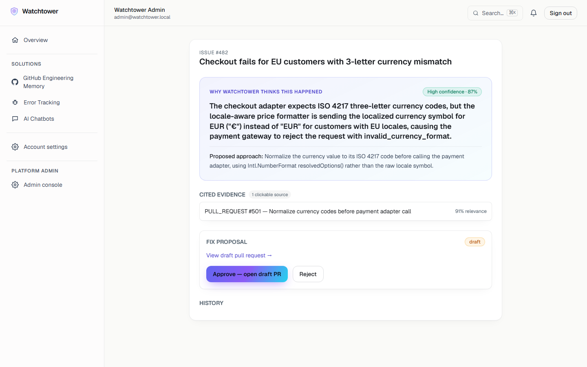
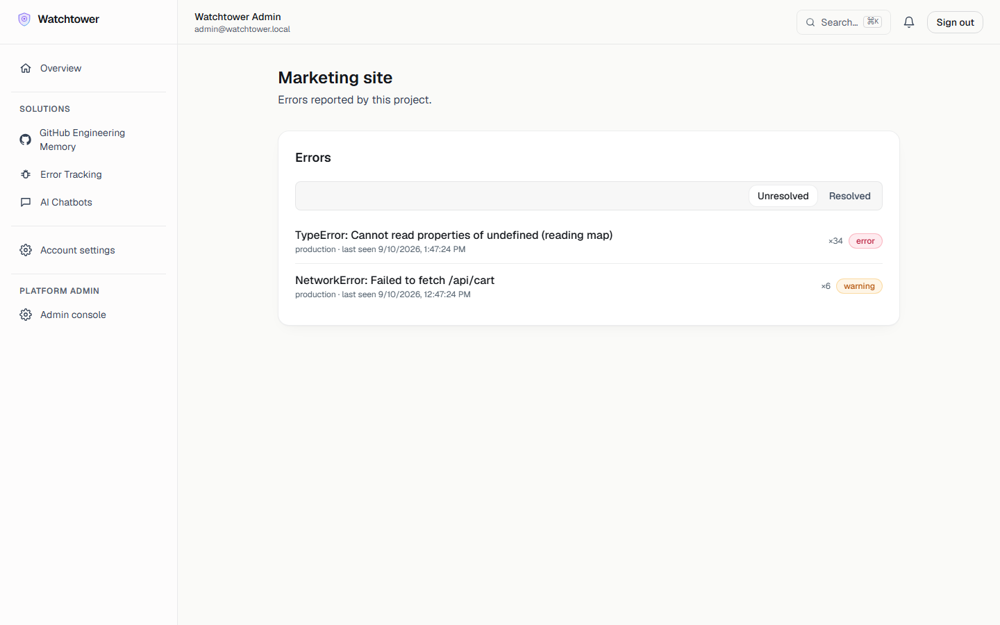
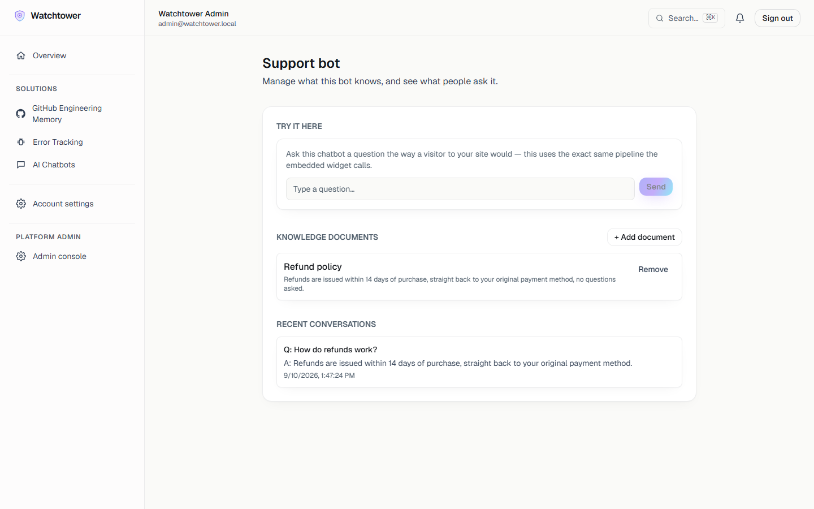
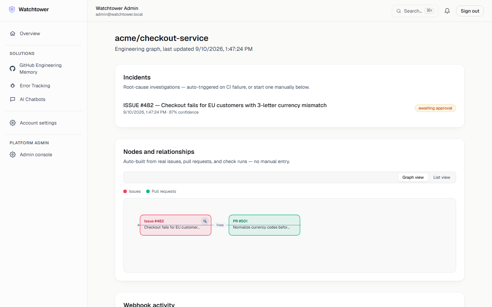
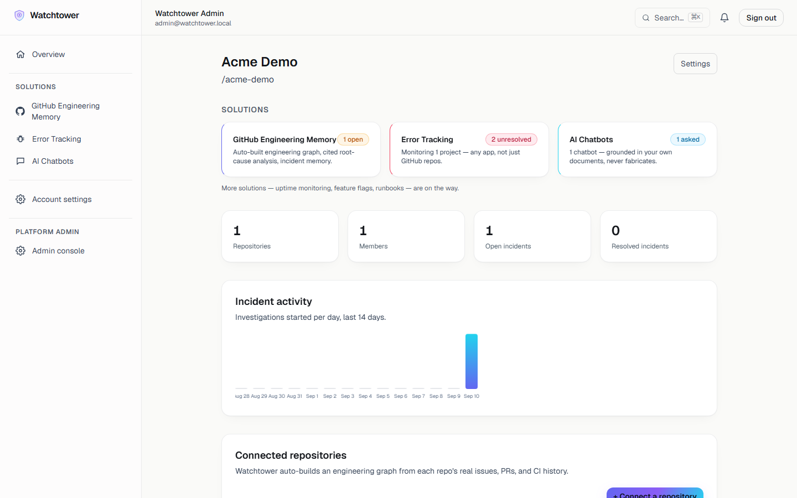
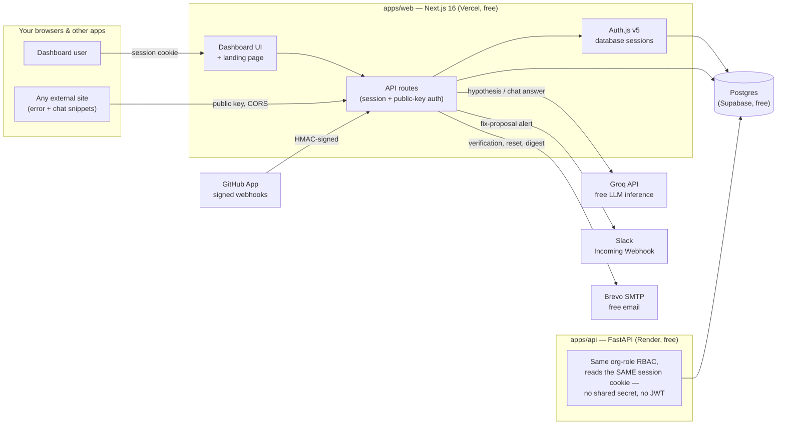
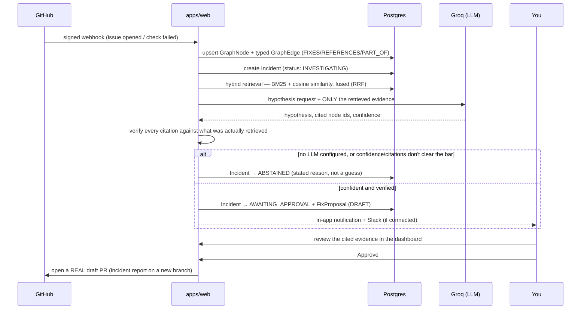
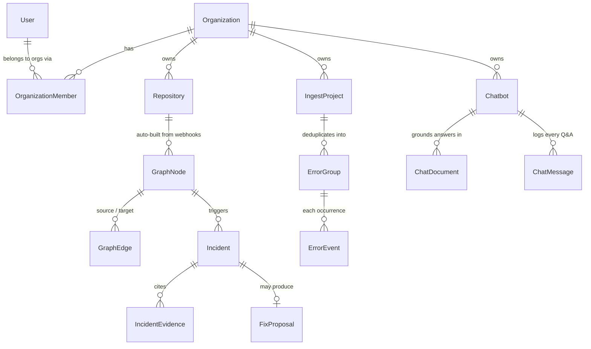

<p align="center">
  
</p>

<p align="center">
  <a href="https://github.com/Mazharul75/watchtower/actions/workflows/ci.yml"></a>
  
  
  
  
</p>

<h1 align="center">Watchtower</h1>

<p align="center">
  <b>Three real engineering solutions, one free platform.</b><br />
  GitHub engineering memory with cited root-cause analysis · error tracking for any app · an AI chatbot grounded in your own docs.
</p>

<p align="center">
  <a href="#-three-solutions">Solutions</a> ·
  <a href="#-architecture">Architecture</a> ·
  <a href="#-how-an-investigation-actually-runs">How it works</a> ·
  <a href="#-data-model">Data model</a> ·
  <a href="#-local-development">Local dev</a> ·
  <a href="#-deployment-production">Deploy</a> ·
  <a href="#-security-baseline">Security</a> ·
  <a href="#-roadmap">Roadmap</a>
</p>

---

This repository is **not a demo** — it's deployed, running, and every screenshot below is the real, live UI, not a mockup.
Follow [`docs/SETUP_FROM_SCRATCH.md`](docs/SETUP_FROM_SCRATCH.md) for the exact, zero-cost path from an empty GitHub
account to your own instance.

## 🧩 Three solutions

Not three features bolted onto one tool — three genuinely separate products sharing one login, one organization
model, and one free deployment, the way a real platform (not a single-purpose app) is put together.

<table>
<tr>
<td width="42%" valign="top">

### 🔎 GitHub Engineering Memory
Connects to a real GitHub repo via a GitHub App install. A webhook receiver
turns every issue, PR, and check run into an auto-built engineering graph.
When something breaks, a hybrid BM25 + vector retrieval step finds the
actual relevant history, an LLM proposes a **cited** hypothesis, every
citation is verified against what was actually retrieved, and a confident
fix opens as a **draft PR for a human to approve** — never an autonomous
merge. Not confident enough? It says so, honestly, instead of guessing.

</td>
<td width="58%">

</td>
</tr>
<tr>
<td width="42%" valign="top">

### 🐞 Error Tracking
A standalone mini error-tracker — has nothing to do with GitHub. Drop one
`<script>` snippet into *any* app (a marketing site, a mobile web view,
anything) and real runtime errors start showing up here, deduplicated into
groups with occurrence counts and full stack traces, exactly like a real
issue tracker. A "send a test error" button proves the pipeline works
before you've touched a second website.

</td>
<td width="58%">

</td>
</tr>
<tr>
<td width="42%" valign="top">

### 🤖 AI Chatbots
A support chatbot for your own site, grounded **only** in documents you
give it — the same hybrid retrieval engine that powers root-cause
analysis, repurposed for Q&A. Ask it something outside its knowledge and
it says *"I don't know"* instead of inventing an answer. Free to run on
[Groq](https://console.groq.com) — no self-hosted model required.

</td>
<td width="58%">

</td>
</tr>
</table>

<p align="center"><i>More solutions — uptime monitoring, feature flags, an internal runbook library — are on the roadmap.</i></p>

<details>
<summary><b>More screenshots</b> — the auto-built engineering graph, and the organization overview</summary>
<br />

<br /><br />

</details>

## 🏗 Architecture



Two backend services deliberately share one database and prove the same authorization boundary two different ways:
`apps/web` enforces org-role RBAC in every Server Component and Route Handler; `apps/api` (FastAPI) enforces the
*identical* rule set independently, by reading the same Auth.js session cookie straight out of Postgres — see
[ADR-001](docs/ADR-001-shared-schema.md).

## 🔬 How an investigation actually runs

The animated pipeline on the [live landing page](docs/assets/banner.svg) isn't decorative — this is the literal
sequence `lib/investigation.ts` executes for every GitHub-triggered incident:



The verification step is the load-bearing one: a citation the model wasn't actually shown is dropped before it ever
reaches a human, which is what makes "cites the evidence" a checkable guarantee instead of a marketing line.

## 🗄 Data model

Simplified — the real schema (`apps/web/prisma/schema.prisma`) has ~25 models across auth, RBAC, and all three
solutions; this is the shape that matters for understanding how they relate:



Every solution hangs off the same `Organization` — the same owner/admin/member/viewer roles, enforced server-side,
govern all three, so adding a new solution has never meant reinventing auth.

## What's actually working right now

**Platform (shared by all three solutions)**
- Email/password signup with mandatory email verification, GitHub OAuth, Google OAuth, and account linking across
  all three.
- Forgot/reset password with one-time, hashed, expiring tokens.
- Database-backed sessions (Postgres, not JWT) for **every** login method, including email/password — see
  [ADR-002](docs/ADR-002-credentials-database-sessions.md) for the Auth.js limitation this works around.
- An "active sessions" list with per-device revoke and "log out everywhere".
- Organizations with server-enforced OWNER/ADMIN/MEMBER/VIEWER roles, a real invite flow, and a Slack-webhook
  integration used across solutions.
- A platform admin console: user list, org list, feature flags, a full audit log, and user impersonation gated
  behind a consent dialog and logged to that same audit trail.
- A ⌘K command palette searching organizations, repositories, and incidents from anywhere in the dashboard.
- Argon2id password hashing, per-route rate limiting, email-enumeration-safe responses, a nonce-based
  Content-Security-Policy, and RBAC enforced server-side (never just hidden in the UI).
- A second backend service (FastAPI) proving the same RBAC boundary independently, by reading the same session
  cookie — and personal API keys (SHA-256 hashed, never stored raw) that authenticate against it too.

**🔎 GitHub Engineering Memory**
- A real GitHub App installation flow; a webhook receiver with HMAC signature verification, duplicate-delivery
  detection, and a feature-flag kill switch turns real issue/PR/check-run events into an auto-built engineering
  graph (typed edges — `FIXES`, `REFERENCES`, `PART_OF` — detected from text like "fixes #42").
- A real node-link graph visualization (not just a list) with hover-to-highlight relationships, plus a dense list
  view for repos with many nodes.
- Hybrid BM25 + cosine-similarity retrieval (Reciprocal Rank Fusion) over that graph.
- A pluggable LLM provider (`none` honest-abstain default, **Groq** — free, no self-hosting — self-hosted Ollama,
  or Anthropic) drives root-cause analysis: retrieve evidence → cited hypothesis → **verify every citation** → a
  confident, verified hypothesis becomes a fix proposal awaiting human approval. Approving one opens a real draft
  PR (an incident report on a new branch — see [ADR-004](docs/ADR-004-phase3-scope-decisions.md)).
  "Incident memory" surfaces similar past incidents via embedding similarity.
- CSV export of every incident in an org; a 14-day incident-activity chart; a real webhook-delivery log per repo.

**🐞 Error Tracking**
- A public, CORS-enabled, rate-limited ingest endpoint authenticated by a per-project public key — genuinely
  callable from any external site.
- Deterministic fingerprint-based deduplication (level + normalized message) groups repeat occurrences into one
  issue with a count, not one row per event; a fixed error that regresses automatically reopens.
- Full stack traces, URLs, releases, and a resolve/reopen workflow.

**🤖 AI Chatbots**
- Real documents, embedded with the same deterministic embedder used for the GitHub graph, retrieved via the same
  hybrid BM25 + vector search (with a stopword filter added specifically for the common "single-document
  knowledge base" case, where naive keyword overlap on words like "of" would otherwise look identical to overlap
  on a real keyword — found and fixed via live testing, see `lib/chatbot.ts`).
- An in-dashboard "try it here" tester using the exact same pipeline as the embedded widget, plus a real
  conversation log so you can see what visitors actually ask.
- Never fabricates: no relevant document → "I don't have information about that"; relevant document but no LLM
  configured → says so plainly, cites what it found anyway.

**Hardening (across the whole platform)**
- User suspend/unsuspend (kills sessions and blocks every login path immediately), a system-health admin
  dashboard, audit-log CSV export, an automated WCAG 2.1 AA accessibility scan (caught and fixed real
  color-contrast regressions during development — including one caused by a CSS entrance-animation racing the
  scanner, a genuinely subtle bug, documented in the ADRs/commit history), a k6 load test script, a documented
  threat model, Privacy Policy + Terms of Service templates, and a launch checklist.
- A real backup/restore drill — 204 rows across 20 tables, restored into a freshly-migrated database, every count
  matched exactly (`scripts/backup-restore-drill.mjs`, see `docs/BACKUP_RESTORE_RUNBOOK.md`).
- **108 backend unit tests** (web) + 3 (worker), **18 end-to-end Playwright tests** (including the accessibility
  scan), **13 FastAPI tests** — all passing against a real Postgres database, not mocked — plus repeated live
  smoke tests: real signed webhook deliveries confirmed the GitHub graph end-to-end; a real POST through the
  error-ingest endpoint confirmed deduplication (`count: 2` after two identical errors); a real chatbot
  conversation confirmed retrieval correctly finds relevant documents *and* correctly rejects irrelevant ones.

## Monorepo layout

```
apps/
  web/      Next.js 16 app — the product itself: UI for all 3 solutions, auth, API routes
  api/      FastAPI service — RBAC-protected endpoints sharing apps/web's DB
  worker/   Scheduled hygiene jobs (expired-session/token cleanup)
packages/
  ui/       Shared design tokens + the Watchtower logo component
  config/   Shared TypeScript config
docs/       Architecture decision records, runbooks, this README's diagrams/screenshots
scripts/    Local dev tooling (embedded Postgres for zero-Docker setup)
```

## Stack

| Layer | Choice |
|---|---|
| Frontend | Next.js 16, React 19, TypeScript, Tailwind CSS v4 |
| Auth | Auth.js v5 (database session strategy), `@node-rs/argon2` |
| Database | PostgreSQL, Prisma ORM (owns all migrations — see [ADR-001](docs/ADR-001-shared-schema.md)) |
| Second backend | FastAPI + SQLAlchemy (async), reading the same DB |
| LLM | Groq (free, recommended) · self-hosted Ollama · Anthropic (bring your own key) |
| Email | Brevo SMTP (free, no domain needed) / any SMTP / Ethereal (local dev, automatic) |
| Notifications | In-app + Slack Incoming Webhooks |
| Monitoring | Sentry (`@sentry/nextjs`, `sentry-sdk`) |
| Testing | Vitest (unit), Playwright (e2e + accessibility), pytest (API) |
| CI | GitHub Actions |

### Deliberate deviations from the original stack decisions, and why

- **npm workspaces instead of pnpm.** The build sandbox this was developed
  in had no pnpm installed. npm workspaces provide the same monorepo
  capability with zero functional loss.
- **Prisma 6.19.3, not the newest Prisma 7.** Prisma 7 removed the
  `datasource { url = env(...) }` pattern in favor of a mandatory
  `prisma.config.ts` + driver-adapter model, a breaking architectural change
  to how the ORM is wired up. Given how new and invasive that change is,
  Prisma 6 (still fully supported, not legacy) was the safer choice for the
  auth-critical piece of a production app.
- **Local Postgres via `embedded-postgres`, not `docker-compose up`,** for
  the environment this was built in, which had no Docker. A `docker-compose.yml`
  is still included and works identically for anyone who does have Docker.
- **Embeddings are a local, deterministic feature-hash function, not a
  transformer model, and are stored as a Postgres `Float[]`, not a pgvector
  column.** No model download, no API key, works everywhere Postgres does —
  see [ADR-003](docs/ADR-003-embeddings-without-pgvector.md) for the honest
  tradeoff and the documented upgrade path.
- **Groq, not self-hosted Ollama, as the recommended production LLM.** Ollama
  needs a server *you* keep running and reachable — impossible on a
  serverless host like Vercel. Groq's free tier needs no self-hosting at all,
  which is the difference between "free in theory" and "free and actually
  usable in production."

## Local development

### 1. Install dependencies

```bash
npm install
```

### 2. Start a real local Postgres (no Docker required)

```bash
npm run db:test-up
```

This downloads and runs genuine community Postgres binaries on `localhost:55432`
(cached under `.embedded-postgres/`, gitignored) — not a mock, not SQLite.
Prefer Docker instead? `docker compose up -d` does the same job using the
`docker-compose.yml` in this repo. Leave this running in its own terminal.

### 3. Configure environment variables

```bash
cp apps/web/.env.example apps/web/.env
cp apps/api/.env.example apps/api/.env
```

The defaults work as-is for local dev: email goes to a free, automatically
created Ethereal test inbox (the preview link is printed to your terminal —
open it to click the real verification/reset link), and no OAuth
credentials are required to use email/password login. To test GitHub/Google
login locally, or to get a free Groq key for real AI answers, follow the
instructions inside `apps/web/.env.example`.

### 4. Migrate and seed the database

```bash
npm run prisma:generate
npm run prisma:migrate --workspace=apps/web   # creates + applies migrations
npm run prisma:seed --workspace=apps/web      # creates a super-admin account
```

The seed script prints the super-admin's email/password — change it
immediately in anything beyond local dev.

### 5. Run the app

```bash
npm run dev:web
```

Visit `http://localhost:3000`.

### 6. (Optional) Run the FastAPI service

```bash
cd apps/api
python -m venv .venv
./.venv/Scripts/activate   # or `source .venv/bin/activate` on macOS/Linux
pip install -r requirements-dev.txt
uvicorn app.main:app --reload --port 8000
```

### 7. (Optional) Connect a real GitHub repository

GitHub ingestion is off by default (`phase2.github_ingestion` feature flag)
until you've created a GitHub App:

1. `github.com/settings/apps` → New GitHub App. **Webhook URL**:
   `http://localhost:3000/api/webhooks/github` (use a tunnel like `ngrok` for
   local testing, since GitHub needs a reachable URL). **Setup URL** (under
   "Post installation"): your app's URL + `/api/github/callback`, with
   **Redirect on update** checked — easy to miss, and the app won't finish
   connecting repos without it. Permissions: Repository contents (read),
   Issues (read), Pull requests (read), Checks (read). Subscribe to events:
   Issues, Pull request, Check run.
2. Copy the App ID, generate a private key (.pem), and set a webhook secret.
   Put all of them in `apps/web/.env` as `GITHUB_APP_ID`,
   `GITHUB_APP_PRIVATE_KEY` (replace real newlines with `\n`),
   `GITHUB_APP_WEBHOOK_SECRET`, and `GITHUB_APP_SLUG` (from the App's URL).
3. Log in as the seeded super-admin, go to `/admin` → Feature flags → enable
   `phase2.github_ingestion`.
4. From an org's page (`/dashboard/orgs/<id>`), click "Connect a
   repository" — this redirects to GitHub's install page and back.

To verify the webhook receiver itself without a live GitHub App or a
tunnel, sign a fixture payload yourself and POST it directly:

```js
const crypto = require("node:crypto");
const secret = "<your GITHUB_APP_WEBHOOK_SECRET>";
const body = JSON.stringify({
  action: "opened",
  repository: { id: 123 }, // must match a Repository.githubRepoId already in your DB
  issue: { number: 1, title: "Test issue", body: null, html_url: "u", state: "open", user: null },
});
const signature = "sha256=" + crypto.createHmac("sha256", secret).update(body).digest("hex");
fetch("http://localhost:3000/api/webhooks/github", {
  method: "POST",
  headers: { "Content-Type": "application/json", "X-GitHub-Event": "issues", "X-GitHub-Delivery": crypto.randomUUID(), "X-Hub-Signature-256": signature },
  body,
}).then((r) => r.json()).then(console.log);
```

### 8. (Optional) Try Error Tracking and AI Chatbots without a second site

Both have an in-dashboard way to see them work immediately — no external
site required to get started: Error Tracking's project page has a **"Send a
test error"** button, and every chatbot has a **"Try it here"** chat box
right on its page.

## Testing

```bash
# Unit tests
npm run test --workspace=apps/web
npm run test --workspace=apps/worker

# Lint + typecheck
npm run lint --workspace=apps/web
npm run typecheck --workspace=apps/web

# End-to-end (requires the app running against a seeded database)
npm run build --workspace=apps/web && npm run start --workspace=apps/web
npx playwright test --config=apps/web/playwright.config.ts

# FastAPI
cd apps/api && pytest -q && ruff check app tests && mypy app --ignore-missing-imports
```

CI (`.github/workflows/ci.yml`) runs all of the above automatically against
a real Postgres service container on every push and pull request.

## Deployment (production)

Every service below has a genuinely free tier sufficient for real usage.
**One thing is not free**, stated plainly rather than glossed over: **a
custom domain** (~$10–15/yr) — everything else, including the free
`*.vercel.app` subdomain, works with no purchase at all.

| Service | Free tier used for | Setup |
|---|---|---|
| **Vercel** | Hosting `apps/web` | Import this repo, set root directory to `apps/web`, add the env vars below. |
| **Supabase** | Production Postgres | Create a free project, copy its connection string into `DATABASE_URL`. |
| **Render** or **Fly.io** | Hosting `apps/api` | Point at `apps/api/Dockerfile`. |
| **Groq** | Free LLM inference | Set `LLM_PROVIDER=groq` and `GROQ_API_KEY` — powers both root-cause analysis and chatbot answers. |
| **Brevo** | Transactional email | Free tier: 300 emails/day, no domain required. Set `SMTP_HOST`/`SMTP_USER`/`SMTP_PASSWORD`. |
| **Slack** | Fix-proposal & alert notifications | Free Incoming Webhook, set per-organization in Settings. |
| **Sentry** | Error monitoring (of Watchtower itself) | Free tier project (Next.js). Set `SENTRY_DSN` / `NEXT_PUBLIC_SENTRY_DSN`. |
| **GitHub Actions** | CI + nightly backups | Already configured in `.github/workflows/`. |
| **Backblaze B2** | Encrypted DB backups | Free 10GB tier. See `.github/workflows/backup.yml` for required secrets. |
| **GitHub App** | Repo ingestion | Free to create. See "Connect a real GitHub repository" above; separate from the OAuth App used for login. |

The full, beginner-friendly, click-by-click version of this table — written for someone who's never touched any of
these services — is [`docs/SETUP_FROM_SCRATCH.md`](docs/SETUP_FROM_SCRATCH.md).

### Required production environment variables (`apps/web`)

See `apps/web/.env.example` for the full list with explanations. At minimum:
`DATABASE_URL`, `AUTH_SECRET` (generate with `npx auth secret`), `NEXTAUTH_URL`
(your real domain), `GITHUB_CLIENT_ID`/`SECRET`, `GOOGLE_CLIENT_ID`/`SECRET`
(OAuth callback URLs must point at your real domain), and `SMTP_HOST`/`SMTP_USER`/`SMTP_PASSWORD`.

### GitHub/Google OAuth app callback URLs in production

- GitHub: `https://yourdomain.com/api/auth/callback/github`
- Google: `https://yourdomain.com/api/auth/callback/google`

## Security baseline

- Argon2id password hashing (OWASP-recommended parameters).
- Rate limiting on login, registration, forgot-password, reset-password, and both public ingest endpoints
  (error-tracking, chatbot).
- Email-enumeration-safe responses on forgot-password and resend-verification.
- One-time, hashed (SHA-256), expiring tokens for email verification (24h)
  and password reset (15m); a reset invalidates every existing session.
- Personal API keys are SHA-256 hashed at rest, shown in full exactly once at creation, and independently
  verified by `apps/api`.
- Nonce-based Content-Security-Policy (see `src/proxy.ts` and the comment in
  `src/app/layout.tsx` about why the nonce must be read via `headers()` for
  Next.js's own scripts to carry it).
- RBAC enforced server-side in every Server Component and Route Handler —
  proxy.ts's cookie-presence check is a UX optimization only, never the
  actual authorization boundary.
- Every privileged action (login, role changes, impersonation, feature-flag
  toggles, member invites, org deletion) is written to an append-only audit log.

**Known, accepted limitation:** `npm audit --omit=dev` reports 0
vulnerabilities in production dependencies. A handful of moderate/high
advisories exist in dev-only tooling (`vitest`/`vite`/`esbuild`'s dev-server
CORS advisory) — these affect only `npm run dev`'s local dev server, never
the deployed app, and are common across the current JS tooling ecosystem.

## Roadmap

The three solutions above are live. Next up, in priority order:

1. **Uptime monitoring** — real scheduled checks against any URL, with a shareable public status page generated
   from the results.
2. **Feature flags** — a lightweight LaunchDarkly for your own apps, backed by a real public API endpoint.
3. **Runbooks** — a searchable internal knowledge base for ops procedures, wired into the same search infra.

See [ADR-004](docs/ADR-004-phase3-scope-decisions.md) for the root-cause-analysis scope decisions,
[THREAT_MODEL.md](docs/THREAT_MODEL.md) for the security review, and
[LAUNCH_CHECKLIST.md](docs/LAUNCH_CHECKLIST.md) for what's left before a real public launch.

## License

MIT — see [LICENSE](LICENSE).
